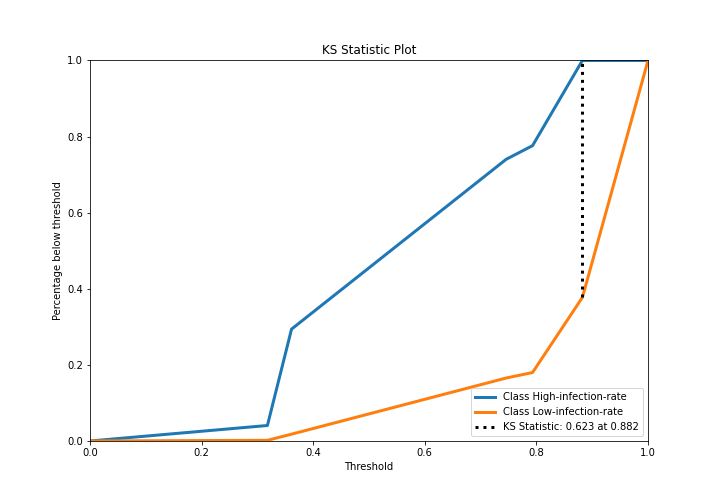

# Summary of 2_DecisionTree

[<< Go back](../README.md)

## Decision Tree
- **n_jobs**: -1
- **criterion**: gini
- **max_depth**: 3
- **explain_level**: 2

## Validation
 - **validation_type**: split
 - **train_ratio**: 0.75
 - **shuffle**: True
 - **stratify**: True

## Optimized metric
logloss

## Training time

35.0 seconds

## Metric details
|           |    score |   threshold |
|:----------|---------:|------------:|
| logloss   | 0.210423 |  nan        |
| auc       | 0.887944 |  nan        |
| f1        | 0.952547 |    0.680592 |
| accuracy  | 0.912102 |    0.680592 |
| precision | 1        |    0.941225 |
| recall    | 1        |    0.286134 |
| mcc       | 0.421553 |    0.872935 |

## Metric details with threshold from accuracy metric
|           |    score |   threshold |
|:----------|---------:|------------:|
| logloss   | 0.210423 |  nan        |
| auc       | 0.887944 |  nan        |
| f1        | 0.952547 |    0.680592 |
| accuracy  | 0.912102 |    0.680592 |
| precision | 0.924769 |    0.680592 |
| recall    | 0.982045 |    0.680592 |
| mcc       | 0.398168 |    0.680592 |

## Confusion matrix (at threshold=0.680592)
|                                |   Predicted as High-infection-rate |   Predicted as Low-infection-rate |
|:-------------------------------|-----------------------------------:|----------------------------------:|
| Labeled as High-infection-rate |                               1249 |                              2999 |
| Labeled as Low-infection-rate  |                                674 |                             36865 |

## Learning curves

## Decision Tree 

### Tree #1

### Rules

if (Compared to National > 1.5) and (Compared to National <= 2.5) then class: Low-infection-rate (proba: 100.0%) | based on 68,226 samples

if (Compared to National <= 1.5) and (Measure Name > 3.5) and (Measure Name > 21.5) then class: Low-infection-rate (proba: 88.25%) | based on 25,266 samples

if (Compared to National <= 1.5) and (Measure Name > 3.5) and (Measure Name <= 21.5) then class: Low-infection-rate (proba: 74.59%) | based on 22,461 samples

if (Compared to National <= 1.5) and (Measure Name <= 3.5) and (Measure ID > 43.0) then class: High-infection-rate (proba: 63.88%) | based on 4,895 samples

if (Compared to National > 1.5) and (Compared to National > 2.5) and (Measure ID <= 43.5) then class: Low-infection-rate (proba: 79.31%) | based on 2,194 samples

if (Compared to National <= 1.5) and (Measure Name <= 3.5) and (Measure ID <= 43.0) then class: Low-infection-rate (proba: 100.0%) | based on 1,605 samples

if (Compared to National > 1.5) and (Compared to National > 2.5) and (Measure ID > 43.5) then class: High-infection-rate (proba: 68.21%) | based on 714 samples

## Permutation-based Importance

## Confusion Matrix

## Normalized Confusion Matrix

## ROC Curve

## Kolmogorov-Smirnov Statistic

## Precision-Recall Curve

## Calibration Curve

## Cumulative Gains Curve

## Lift Curve

## SHAP Importance

## SHAP Dependence plots

### Dependence (Fold 1)

## SHAP Decision plots

### Top-10 Worst decisions for class 0 (Fold 1)

### Top-10 Best decisions for class 0 (Fold 1)

### Top-10 Worst decisions for class 1 (Fold 1)

### Top-10 Best decisions for class 1 (Fold 1)

[<< Go back](../README.md)
