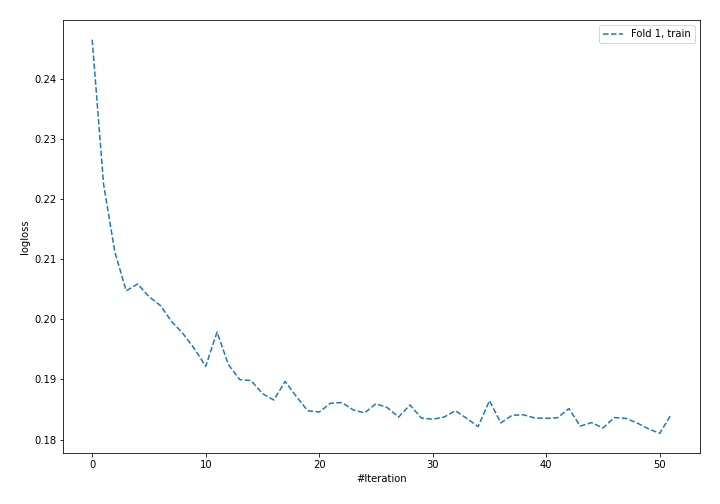
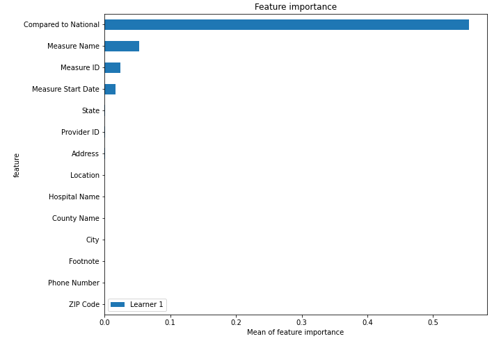
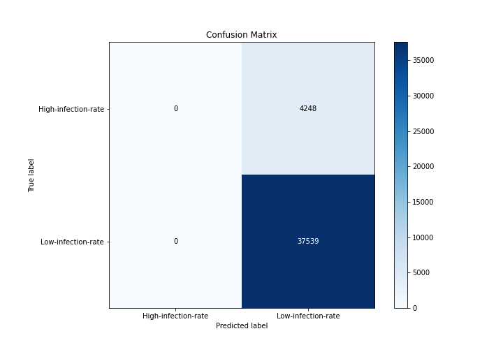
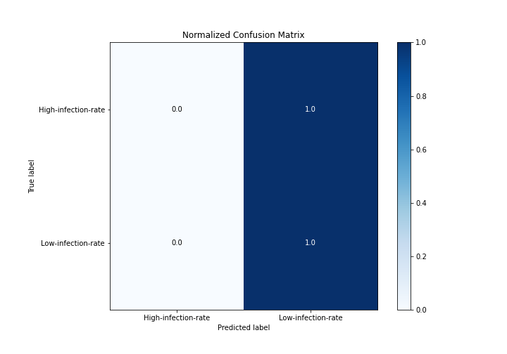
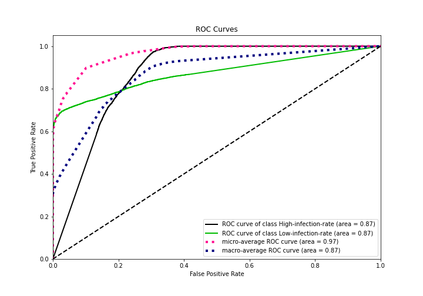
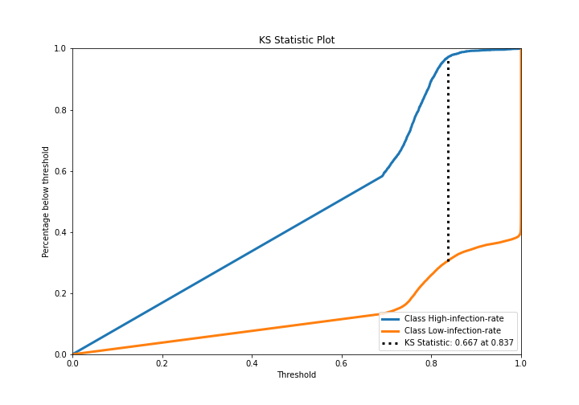
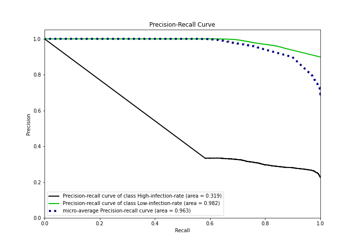
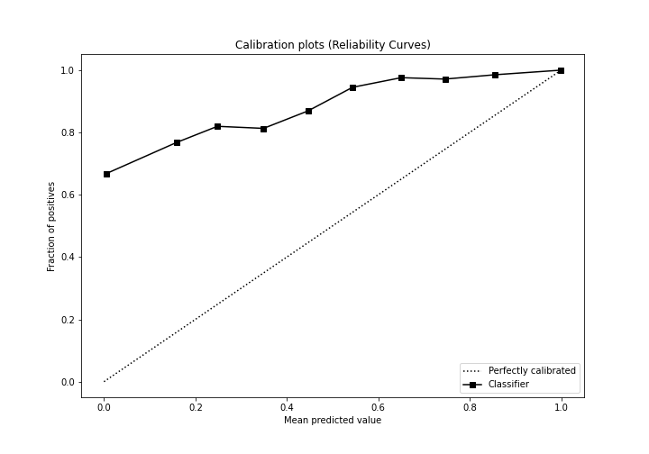
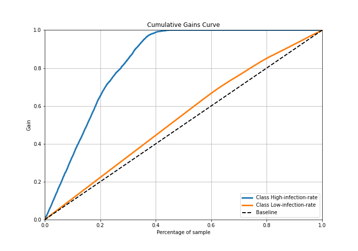
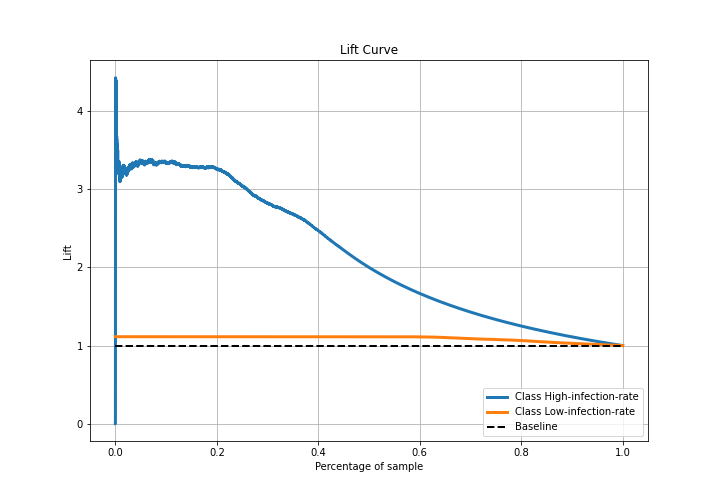

# Summary of 4_Default_NeuralNetwork

[<< Go back](../README.md)

## Neural Network
- **n_jobs**: -1
- **dense_1_size**: 32
- **dense_2_size**: 16
- **learning_rate**: 0.05
- **explain_level**: 2

## Validation
 - **validation_type**: split
 - **train_ratio**: 0.75
 - **shuffle**: True
 - **stratify**: True

## Optimized metric
logloss

## Training time

46.7 seconds

## Metric details
|           |    score |   threshold |
|:----------|---------:|------------:|
| logloss   | 0.225101 |  nan        |
| auc       | 0.871916 |  nan        |
| f1        | 0.946449 |    0.621767 |
| accuracy  | 0.898342 |    0.621767 |
| precision | 1        |    0.999993 |
| recall    | 1        |    0.621767 |
| mcc       | 0.415978 |    0.835621 |

## Metric details with threshold from accuracy metric
|           |    score |   threshold |
|:----------|---------:|------------:|
| logloss   | 0.225101 |  nan        |
| auc       | 0.871916 |  nan        |
| f1        | 0.946449 |    0.621767 |
| accuracy  | 0.898342 |    0.621767 |
| precision | 0.898342 |    0.621767 |
| recall    | 1        |    0.621767 |
| mcc       | 0        |    0.621767 |

## Confusion matrix (at threshold=0.621767)
|                                |   Predicted as High-infection-rate |   Predicted as Low-infection-rate |
|:-------------------------------|-----------------------------------:|----------------------------------:|
| Labeled as High-infection-rate |                                  0 |                              4248 |
| Labeled as Low-infection-rate  |                                  0 |                             37539 |

## Learning curves

## Permutation-based Importance

## Confusion Matrix

## Normalized Confusion Matrix

## ROC Curve

## Kolmogorov-Smirnov Statistic

## Precision-Recall Curve

## Calibration Curve

## Cumulative Gains Curve

## Lift Curve

[<< Go back](../README.md)
