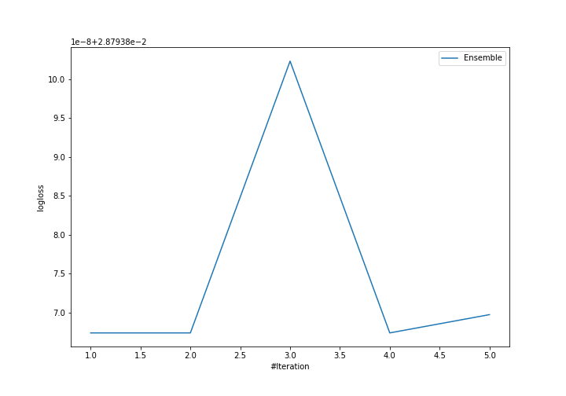
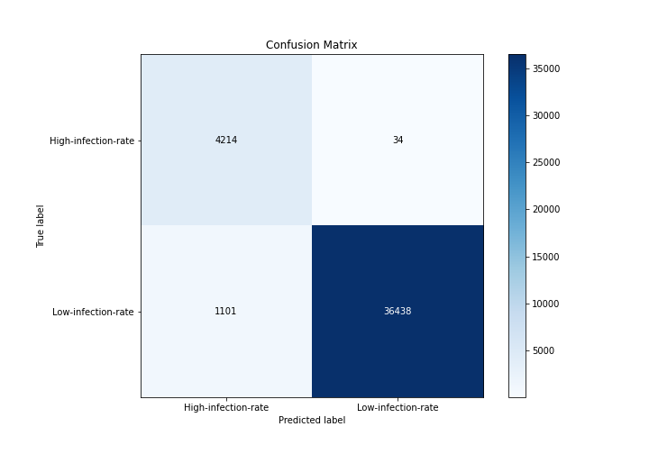
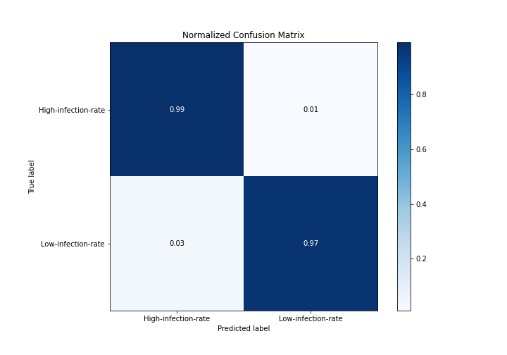
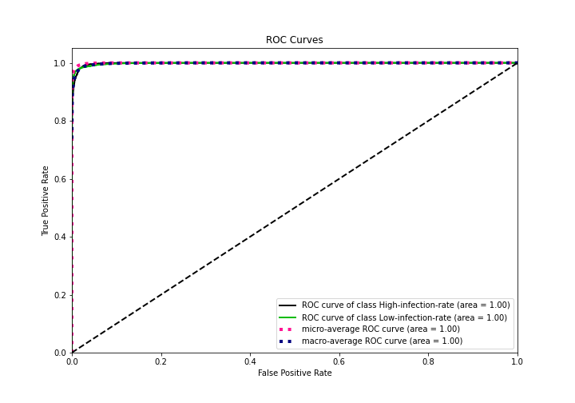
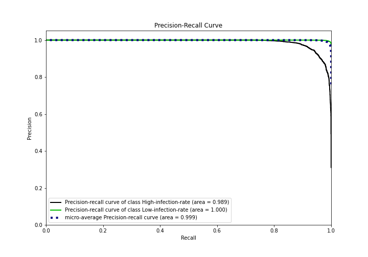
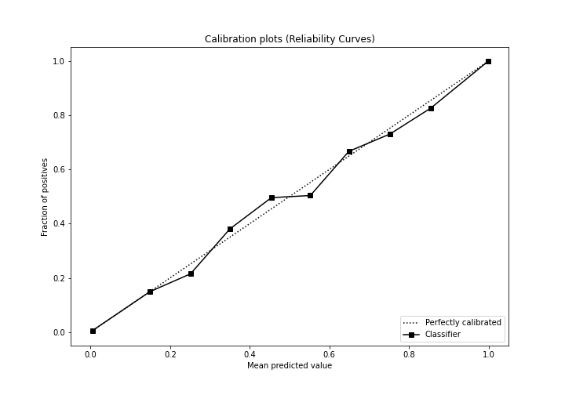
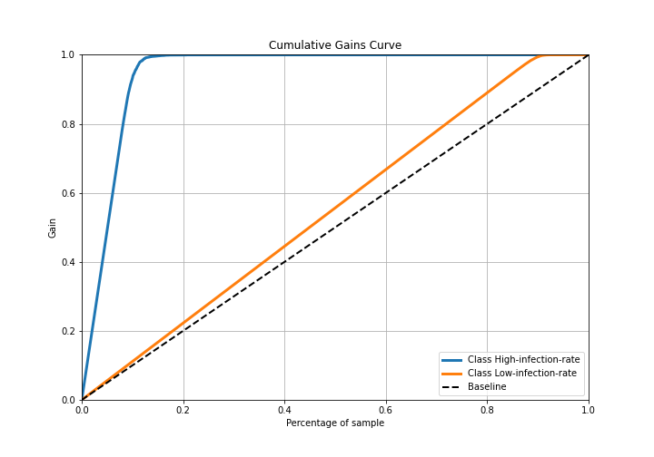
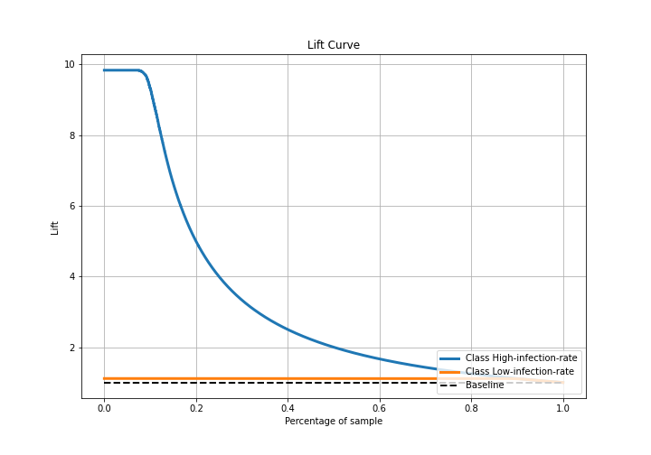

# Summary of Ensemble

[<< Go back](../README.md)

## Ensemble structure
| Model             |   Weight |
|:------------------|---------:|
| 3_Default_Xgboost |        1 |

## Metric details
|           |     score |     threshold |
|:----------|----------:|--------------:|
| logloss   | 0.0287939 | nan           |
| auc       | 0.998495  | nan           |
| f1        | 0.984664  |   0.942205    |
| accuracy  | 0.972838  |   0.942205    |
| precision | 1         |   0.999999    |
| recall    | 1         |   9.06675e-08 |
| mcc       | 0.873128  |   0.942205    |

## Metric details with threshold from accuracy metric
|           |     score |   threshold |
|:----------|----------:|------------:|
| logloss   | 0.0287939 |  nan        |
| auc       | 0.998495  |  nan        |
| f1        | 0.984664  |    0.942205 |
| accuracy  | 0.972838  |    0.942205 |
| precision | 0.999068  |    0.942205 |
| recall    | 0.970671  |    0.942205 |
| mcc       | 0.873128  |    0.942205 |

## Confusion matrix (at threshold=0.942205)
|                                |   Predicted as High-infection-rate |   Predicted as Low-infection-rate |
|:-------------------------------|-----------------------------------:|----------------------------------:|
| Labeled as High-infection-rate |                               4214 |                                34 |
| Labeled as Low-infection-rate  |                               1101 |                             36438 |

## Learning curves

## Confusion Matrix

## Normalized Confusion Matrix

## ROC Curve

## Kolmogorov-Smirnov Statistic

## Precision-Recall Curve

## Calibration Curve

## Cumulative Gains Curve

## Lift Curve

[<< Go back](../README.md)
