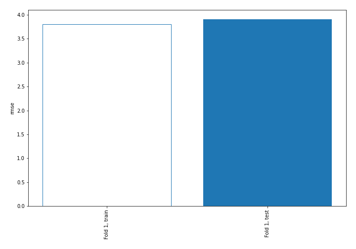
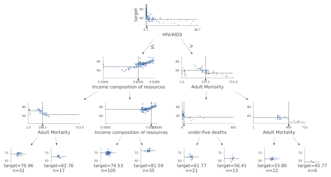
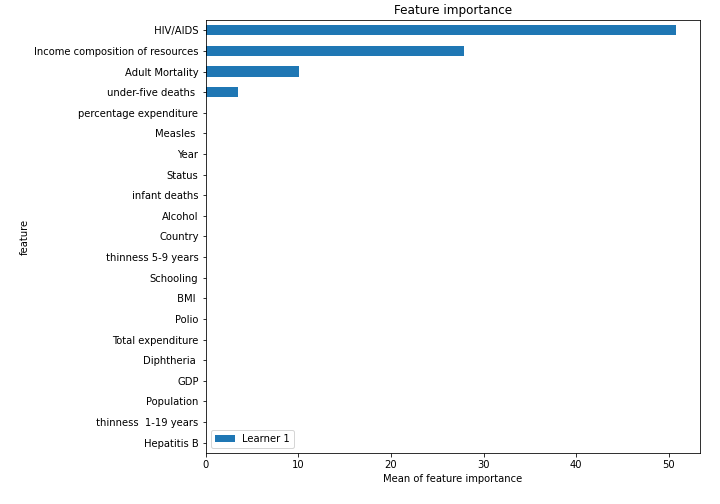
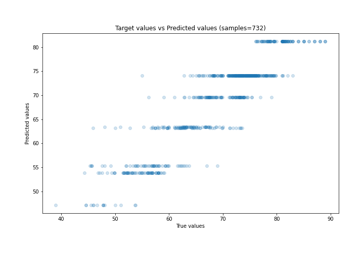
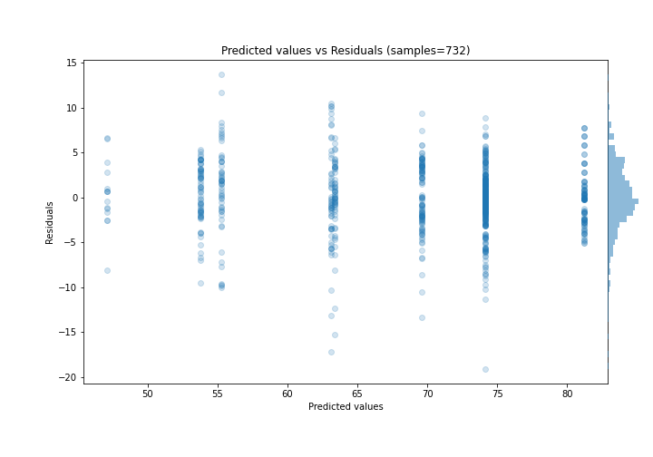
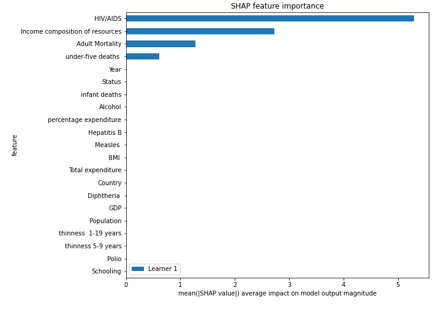
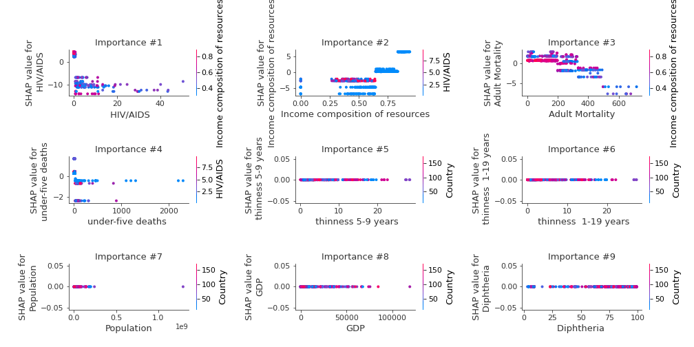
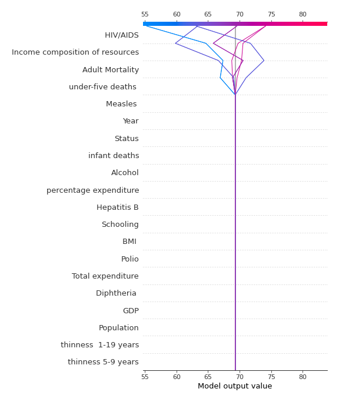
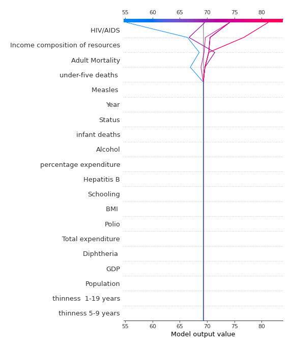

# Summary of 2_DecisionTree

[<< Go back](../README.md)

## Decision Tree
- **n_jobs**: -1
- **criterion**: mse
- **max_depth**: 3
- **explain_level**: 2

## Validation
 - **validation_type**: split
 - **train_ratio**: 0.75
 - **shuffle**: True

## Optimized metric
rmse

## Training time

11.1 seconds

### Metric details:
| Metric   |     Score |
|:---------|----------:|
| MAE      |  2.90576  |
| MSE      | 15.2745   |
| RMSE     |  3.90826  |
| R2       |  0.829197 |
| MAPE     |  0.044289 |

## Learning curves

## Decision Tree 

### Tree #1

### Rules

if ( HIV/AIDS <= 0.75) and (Income composition of resources > 0.644) and (Income composition of resources <= 0.836) then response: 74.116 | based on 904 samples

if ( HIV/AIDS <= 0.75) and (Income composition of resources > 0.644) and (Income composition of resources > 0.836) then response: 81.188 | based on 295 samples

if ( HIV/AIDS <= 0.75) and (Income composition of resources <= 0.644) and (Adult Mortality <= 198.5) then response: 69.582 | based on 272 samples

if ( HIV/AIDS > 0.75) and (Adult Mortality <= 331.5) and (under-five deaths  <= 24.5) then response: 63.134 | based on 190 samples

if ( HIV/AIDS > 0.75) and (Adult Mortality > 331.5) and (Adult Mortality <= 493.0) then response: 53.794 | based on 181 samples

if ( HIV/AIDS <= 0.75) and (Income composition of resources <= 0.644) and (Adult Mortality > 198.5) then response: 63.365 | based on 172 samples

if ( HIV/AIDS > 0.75) and (Adult Mortality <= 331.5) and (under-five deaths  > 24.5) then response: 55.291 | based on 138 samples

if ( HIV/AIDS > 0.75) and (Adult Mortality > 331.5) and (Adult Mortality > 493.0) then response: 47.141 | based on 44 samples

## Permutation-based Importance

## True vs Predicted

## Predicted vs Residuals

## SHAP Importance

## SHAP Dependence plots

### Dependence (Fold 1)

## SHAP Decision plots

### Top-10 Worst decisions (Fold 1)

### Top-10 Best decisions (Fold 1)

[<< Go back](../README.md)
