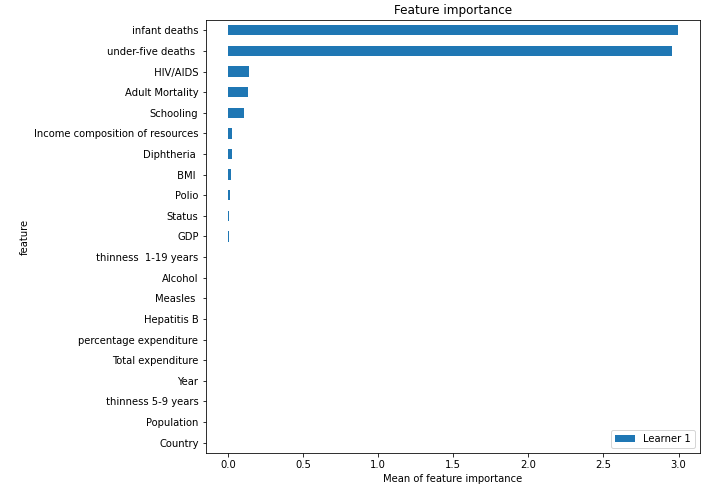

# Summary of 3_Linear

[<< Go back](../README.md)

## Linear Regression (Linear)
- **n_jobs**: -1
- **explain_level**: 2

## Validation
 - **validation_type**: split
 - **train_ratio**: 0.75
 - **shuffle**: True

## Optimized metric
rmse

## Training time

4.0 seconds

### Metric details:
| Metric   |      Score |
|:---------|-----------:|
| MAE      |  3.00998   |
| MSE      | 16.4868    |
| RMSE     |  4.0604    |
| R2       |  0.81564   |
| MAPE     |  0.0461957 |

## Learning curves

## Coefficients
| feature                         |    Learner_1 |
|:--------------------------------|-------------:|
| infant deaths                   |  1.20636     |
| Schooling                       |  0.230052    |
| Income composition of resources |  0.116017    |
| Diphtheria                      |  0.108187    |
| BMI                             |  0.0932978   |
| Polio                           |  0.0617026   |
| GDP                             |  0.0488629   |
| Country                         |  0.036451    |
| Alcohol                         |  0.0231149   |
| percentage expenditure          |  0.0227385   |
| Total expenditure               |  0.00715425  |
| Population                      |  0.000747177 |
| thinness 5-9 years              |  0.000445386 |
| intercept                       |  8.8469e-16  |
| Year                            | -0.00706362  |
| Measles                         | -0.0261487   |
| thinness  1-19 years            | -0.0389892   |
| Hepatitis B                     | -0.0477064   |
| Status                          | -0.0618099   |
| HIV/AIDS                        | -0.257702    |
| Adult Mortality                 | -0.260824    |
| under-five deaths               | -1.234       |

## Permutation-based Importance

## True vs Predicted

## Predicted vs Residuals

## SHAP Importance

## SHAP Dependence plots

### Dependence (Fold 1)

## SHAP Decision plots

### Top-10 Worst decisions (Fold 1)

### Top-10 Best decisions (Fold 1)

[<< Go back](../README.md)
